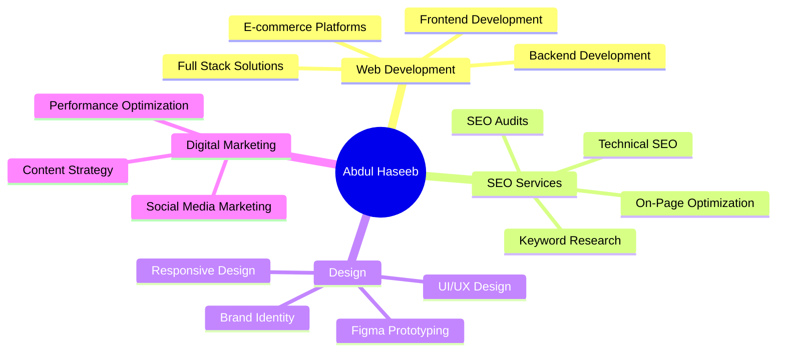

<div align="center">

[](https://haseebcodes-eight.vercel.app/)


</div>

<div align="center">
  
[](https://git.io/typing-svg)

<p align="center">
  
  
  
  
</p>

<p align="center">
  <a href="https://haseebcodes-eight.vercel.app/">
    
  </a>
  <a href="mailto:abdulhaseebmughal2006@gmail.com">
    
  </a>
  <a href="https://linkedin.com/in/abdul-haseeb-developer">
    
  </a>
  <a href="https://instagram.com/haseebmughal2006">
    
  </a>
  <a href="https://wa.me/923331355286">
    
  </a>
  <a href="https://www.hackerrank.com/profile/abdulhaseebmugh1">
    
  </a>
</p>


</div>


###  About Me

```javascript
const abdulHaseeb = {
    title: "Tech Visionary",
    location: "Karachi, Pakistan 🇵🇰",
    role: "Senior Full Stack Developer",
    experience: "2+ Years Professional Experience",
    education: "Bachelor's in Computer Science",
    
    currentPositions: [
        "Full Stack Developer @ Sysovo (Oct 2025 - Present)",
        "Full Stack Developer @ Hawk Horizon (Oct 2025 - Present)",
        "Web Developer & SEO Specialist @ Webixus (Oct 2025 - Present)"
    ],
    
    previousExperience: [
        "Full Stack Developer @ ScandicTech AB (Jan 2025 - Oct 2025)",
        "Full Stack Developer Intern @ Zerovertical Labs (Jun 2025 - Jul 2025)"
    ],
    
    expertise: {
        frontend: ["React.js", "Next.js", "React Native", "Tailwind CSS", "Bootstrap"],
        backend: ["Node.js", "Express.js", "PHP", "REST APIs"],
        database: ["MongoDB", "MySQL", "Supabase", "Firebase"],
        cms: ["WordPress", "Shopify"],
        design: ["Figma", "Responsive Design", "UI/UX"],
        seo: ["Technical SEO", "Keyword Research", "On-Page Optimization"],
        tools: ["Git", "GitHub", "Postman", "VS Code"],
        emerging: ["AI Integration", "Machine Learning", "Cloud Computing"]
    },
    
    achievements: {
        projectsDelivered: "50+",
        clientsSatisfied: "100+",
        companiesWorked: "4+",
        certifications: "15+",
        profileViews: "51 in last 7 days",
        connections: "500+"
    },
    
    philosophy: "I don't just build websites; I craft seamless digital journeys " +
                "where design meets performance and SEO ensures they're found by " +
                "the right people. Every line of code is aimed at making the web " +
                "smarter, faster, and more beautiful."
};
```

<br>

###  Professional Experience

<details>
<summary><b>🏢 Current Roles (Click to expand)</b></summary>
<br>

#### **Full Stack Developer** @ [Sysovo](https://sysovo.com)
`Oct 2025 - Present` | `Karachi, Pakistan` | `On-site`

Building responsive websites, custom software, and e-commerce platforms using the MERN stack. Working on both frontend and backend to ensure performance, scalability, and exceptional user experience. Integrating SEO strategies and brand identity into every project.

**Tech Stack:** MERN Stack, SEO, Digital Marketing, E-commerce Solutions

---

#### **Full Stack Developer** @ [Hawk Horizon](https://hawkhorizon.com)
`Oct 2025 - Present` | `Karachi, Pakistan` | `On-site`

Developing responsive web applications with focus on performance and scalability. Collaborating with designers and marketers to create SEO-optimized websites, e-commerce platforms, and AI-powered features.

**Tech Stack:** MERN Stack, AI Features, SEO Optimization, E-commerce

---

#### **Web Developer & SEO Specialist** @ Webixus
`Oct 2025 - Present` | `Pakistan` | `Self-employed`

Building modern, responsive websites and web applications while optimizing them for search engines. Creating scalable, high-performance platforms that enhance user experience, boost visibility, and drive measurable results.

**Tech Stack:** Web Development, SEO, Digital Solutions, Performance Optimization

</details>

<details>
<summary><b>📚 Previous Experience (Click to expand)</b></summary>
<br>

#### **Full Stack Web Developer & SEO Associate** @ ScandicTech AB
`Jan 2025 - Oct 2025` | `Copenhagen, Denmark` | `Remote`

Leveraged skills in CMS platforms, JavaScript, React, Node.js, and MongoDB to develop dynamic web applications. Conducted SEO audits, keyword research, and strategy implementation to improve organic search rankings.

**Tech Stack:** React, Node.js, MongoDB, CMS Platforms, SEO Strategy

---

#### **Full Stack Developer Intern** @ Zerovertical Labs
`Jun 2025 - Jul 2025` | `Karachi, Pakistan` | `On-site`

Intensive full-stack internship gaining hands-on experience in React.js, Next.js, Node.js, and Supabase. Built real-world web apps with Tailwind CSS, WordPress, and Shopify.

**Tech Stack:** React.js, Next.js, Node.js, Supabase, Tailwind CSS, WordPress, Shopify

</details>

<br>

###  Tech Stack & Expertise

<div align="center">

#### Frontend Development


#### Backend & Database


#### CMS & E-commerce


#### Design & Tools


#### SEO & Marketing


</div>

<br>

###  Certifications & Achievements

<div align="center">

| Certification | Issuer | Year | Credential |
|:-------------|:-------|:-----|:-----------|
| 🏆 **Keyword Research Essentials** | Semrush | 2025 | [View Certificate](https://www.semrush.com) |
| 🏆 **Front End Development Libraries** | freeCodeCamp | 2025 | [View Certificate](https://www.freecodecamp.org/certification/abdul-haseeb-mughal-fedl) |
| 🏆 **Career Essentials in GitHub** | Microsoft & LinkedIn | 2025 | [View Certificate](https://linkedin.com) |
| 🏆 **Career Essentials in Generative AI** | Microsoft & LinkedIn | 2025 | [View Certificate](https://linkedin.com) |
| 🏆 **Career Essentials in Software Development** | Microsoft & LinkedIn | 2025 | [View Certificate](https://linkedin.com) |
| 🎓 **HTML & CSS Certification** | Saylani Mass I.T Training | 2024 | Certified |
| 🎓 **Firebase Development** | Saylani Mass I.T Training | 2024 | Certified |


</div>

<br>

###  Featured Projects & Highlights

<div align="center">

<table>
  <tr>
    <td align="center" width="33%">
      
      <br><b>AI Study Assistant</b>
      <br><sub>Built during Hacktoberfest with DigitalOcean</sub>
      <br><sub>Summarizes papers, creates quizzes & flashcards</sub>
      <br><a href="https://your-project-link.com">View Project</a>
    </td>
    <td align="center" width="33%">
      
      <br><b>Free QR Code Generator</b>
      <br><sub>Zero Vertical Labs Project</sub>
      <br><sub>Custom QR codes with design options</sub>
      <br><a href="https://qr-generator-link.com">View Project</a>
    </td>
    <td align="center" width="33%">
      
      <br><b>E-commerce Solutions</b>
      <br><sub>Built for Multiple Clients</sub>
      <br><sub>Shopify & Custom Platforms</sub>
      <br><a href="https://haseebcodes-eight.vercel.app">View Portfolio</a>
    </td>
  </tr>
</table>

</div>

<br>

###  GitHub Analytics

<div align="center">
  


</div>

<br>

###  Profile Insights

<div align="center">

<table>
  <tr>
    <td align="center">
      
    </td>
    <td align="center">
      
    </td>
    <td align="center">
      
    </td>
  </tr>
  <tr>
    <td align="center">
      
    </td>
    <td align="center">
      
    </td>
    <td align="center">
      
    </td>
  </tr>
</table>


</div>

<br>

###  Let's Connect & Collaborate

<div align="center">

[](https://haseebcodes-eight.vercel.app/)
[](mailto:abdulhaseebmughal2006@gmail.com)
[](https://linkedin.com/in/abdul-haseeb-developer)
[](https://wa.me/923331355286)
[](https://instagram.com/haseebmughal2006)
[](https://www.hackerrank.com/profile/abdulhaseebmugh1)


</div>

<br>

### 💼 Services Offered

<div align="center">



</div>

<br>

### 🎓 Education

<div align="center">

| Institution | Degree | Duration | Grade |
|:-----------|:-------|:---------|:------|
| **Virtual University of Pakistan** | Bachelor's in Computer Science | 2025 - Present | Ongoing |
| **College For Advanced Studies (CAS)** | Intermediate in Computer Science | 2022 - 2024 | A+ |

</div>

<br>

### 💭 Philosophy & Approach

<div align="center">


**"I don't just build websites; I craft seamless digital journeys where creativity meets code and strategy meets growth."**

</div>

<br>

### 🌟 Testimonials

<div align="center">

> **"I would highly recommend Abdul Haseeb to anyone looking for a reliable, skilled, and motivated individual. They would be a valuable asset to any organization."**  
> **— Abdul Rehman Bhatti**, Full Stack Developer

> **"Haseeb is not only skilled in the MERN stack but also brings great focus and calmness to the team. His positive attitude and willingness to help others makes working with him collaborative and smooth."**  
> **— Mirza Abdullah Baig**, Full Stack Developer at Zero Vertical Lab

</div>

<br>


<div align="center">
  
### ⭐ Found my profile interesting? Star my repositories and let's build something amazing together!

**"Building the future, one commit at a time"** 🚀

[](https://github.com/abdulhaseebmughal)

</div>
